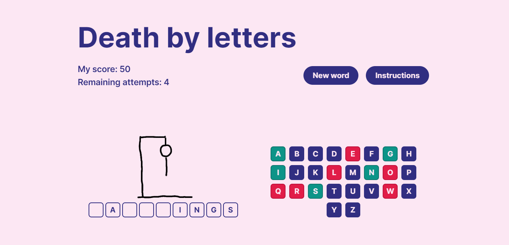

# Death by letters - A hangman game

Death by letters is the classic hangman game. You get 10 attempts for each word. Redux used for store management and TailwindCSS for styling. Words are loaded from https://random-word-api.herokuapp.com/word using fetch API.

## Table of contents

-   [How to play](#how-to-play)
-   [How to install and run the app](#how-to-install-and-run-the-app)
-   [Building a standalone version](#building-a-standalone-version)
-   [Dependencies](#dependencies)
-   [References](#references)
-   [Author](#author)
-   [Credits](#credits)

## How to play

-   For each round, you'll need to guess the correct word by choosing the matching letters.
-   Everytime you select an incorrect letter, you lose an attempt and the hangman starts to appear.
-   A part of the drawing appears each time you guess incorrectly.
-   You have 10 attempts until the drawing is complete. If it reaches the end, you lose the game.
-   Guess all of the correct letters before you lose all attempts, and you win the round.
-   Tap one of the letters or press a key on your keyboard. For each correct letter, you get 10 points added to your score.

### Screenshot:

## How to install and run the app

To get started, clone the repository onto your local machine. \
E.g. Open VS Code and type in the terminal:

`git clone https://github.com/davidllopes/death-by-letters.git` \
`cd death-by-letters`

Run `npm install` in the terminal to install the dependencies.

After installing, run `npm start` - runs the app in the development mode.\
Open [http://localhost:3000](http://localhost:3000) to view in browser.

## Building a standalone version

To get the app ready for production use `npm run build`. The app will be ready to be run locally or uploaded to a server.

## Dependencies

This project uses [Redux](https://www.npmjs.com/package/@reduxjs/toolkit) for store handling and [TailwindCSS](https://www.npmjs.com/package/tailwindcss) for styling.

## References

This project was bootstrapped with [Create React App](https://github.com/facebook/create-react-app).

## Author

Developed by David Lopes for the Web Development Skills Bootcamp at HyperionDev. \
Visit my learner portfolio here: https://www.hyperiondev.com/portfolio/109225/

## Credits

Words are provided by https://random-word-api.herokuapp.com.
